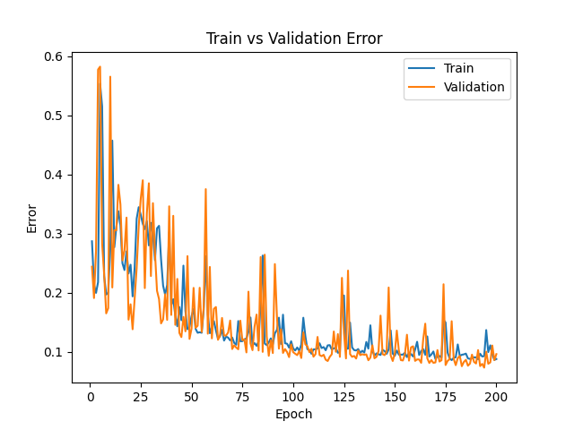
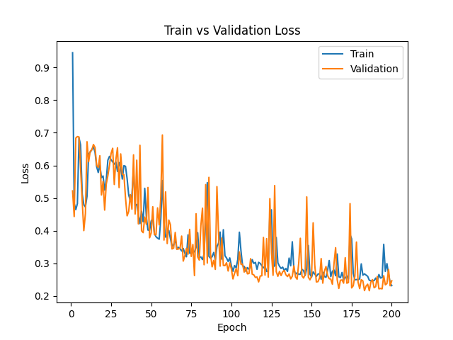
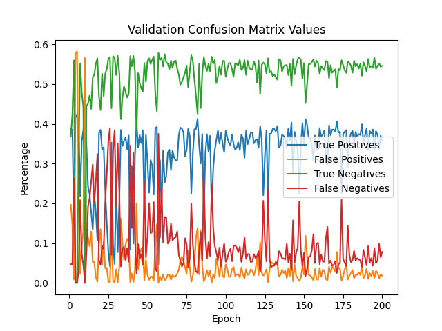

# Fake News Predictor

## Introduction
The program I created is an easy to configure, artificial neural network model that uses Global Vector (GloVe) embeddings to predict the validity of a given new article. The model uses data from the author, title and text of an article to predict whether an article holds misinformation. This document holds general overview information on the program, and documentation within the code holds all the detailed information on the structure and functionality of the prediction. 

To properly use, set up a virtual environment and install the libraries provided in the requirements.txt. Additionally, the dataset.zip file will need to be extracted to create a directory with the same name ("\dataset"). When the program is first run, the GloVe embeddings will need to be downloaded, which will take several minutes to complete. From there there is limited latency.

## 1. General Pipeline Orchestration
Information on the training, testing and sample data are all imported from the configuration file (config.json). Within the configuration file is an option to put a model name, in which case the program will bypass the training process and purely generate results on the test and sample data. The DataLoader object initially loads in all the datapoints from the provided data sets and formats them as seen in the next section. Once the data sets are loaded in, the DataLoader handles randomization and batching of each of the training data points. The sample and test sets are left as is. 

For training the model through a wide range of hyper parameters, the configuration file holds a list of different model settings to iterate through. The Neural Network object will generate the set of unique runs for the training of the model. The confusion matrix is calculated for each of the validation data points and the error rate, loss values and confusion matrix metrics are saved at adjustable epoch intervals in both a csv as well as a plot. After sweeping through a wide set of hyper_parameter options

After training, the program takes the either provided model name from the config, or the most recently trained model and calculates the testing accuracy and predictions for a blank sample. The results from the testing and the predictions are all displayed on the console.

## 2. Input Data Format
The input for the model is a tensor of size [3, 300] where the 3 dimensions equate to the input headings (author, title and text) and the 300 is the respective summed GloVe embeddings for the respective data field. This gets condensed to an input layer with 900 nodes, which through the network gets compressed down to an individual yes or no for the validity of the article.

## 3. Hyper Parameters
The model swept through the following hyperparameter with the following values:
    - batch size: 4, 8, 16
    - learning rate: 0.001, 0.01, 0.0001
    - hidden layer nodes: 32, 64, 128
    - total training epochs: 50, 100, 200

After that initial sweep, I analyzed the results and determined that the following set of hyper parameters produced the best results:
    - **batch size: 32**
    - **learning rate: 0.0001**
    - **hidden layer nodes: 128**
    - **total training epochs: 200**

This combination lead to a testing accuracy of **0.589** and produced the following plots:

## 4. Output Files
The save_rate key of the config determines how frequently the model's training information is saved. When saved, the model creates a series of csv sheets holding the per epoch values for training and validation error, training and validation loss, as well as the validation false positive rate, false negative rate, true positive rate and true negative rate.

Along with that at the end of each training run, the program saves a plot of the training and validation error, the training and validation loss and the validation confusion matrix metrics, ploted against the epochs of the training set.

## 5. Using with a Random Sample
To use the program for purely evaluating a random sample, ensure that the model name reflects a previously trained model and that the config value for the model name is not "null"

From there fill out a sample csv with title, author and text fields. Ensure that the path in the configuration file pointing to the sample csv is correct and run the program. No training will happen, only evaluation of the test data and the provided sample.
